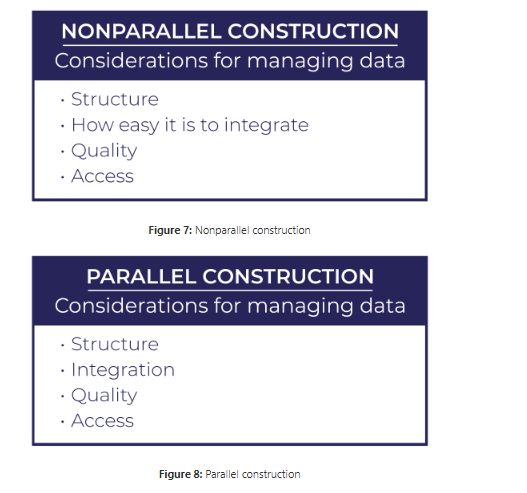
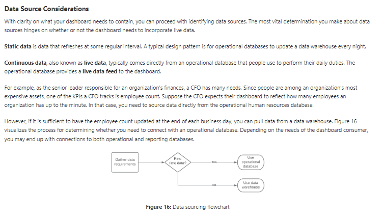
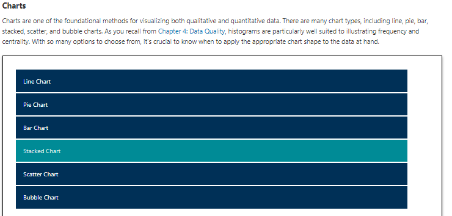

# Chpater 6
Python & R & SQL

Structured Query Language (SQL)
The Structured Query Language (SQL) is the language of databases. Any time a developer, administrator, or end user interacts with a database, that interaction happens through the use of a SQL command. SQL is divided into two major sublanguages:

• The Data Definition Language (DDL) is used mainly by developers and administrators. It's used to define the structure of the database itself. It doesn't work with the data inside a database, but it sets the ground rules for the database to function.

• The Data Manipulation Language (DML) is the subset of SQL commands that are used to work with the data inside of a database. They do not change the database structure, but they add, remove, and change the data inside a database.

As you prepare for the exam, you'll need to be familiar with the major commands used in SQL. It's important to understand that you are not responsible for writing or reading SQL commands. You just need to know what the major commands are and when you would use them.

There are three DDL commands that you should know:

• The CREATE command is used to create a new table within your database or a new database on your server.

• The ALTER command is used to change the structure of a table that you've already created. If you want to modify your database or table, the ALTER command lets you make those modifications.

• The DROP command deletes an entire table or database from your server. It's definitely a command that you'll want to use with caution!

There are also four DML commands that you should know:

• The SELECT command is used to retrieve information from a database. It is the most commonly used command in SQL as it is used to pose queries to the database and retrieve the data that you're interested in working with.

• The INSERT command is used to add new records to a database table. If you are adding a new employee, customer order, or marketing activity, the INSERT command allows you to add one or more rows to your database.

• The UPDATE command is used to modify rows in the database. If you need to change something that is already stored in your database, the UPDATE command will do that.

• The DELETE command is used to delete rows from a database table. Don't confuse this command with the DROP command. The DROP command deletes an entire database table, whereas the DELETE command just deletes certain rows from the table.

Statistics packages

    1. IBM SPSS
    2. Stata 
    3. Minitab 
    
Machine Learning

    1. IBM SPSS Modeler - tool for building graphical machine learning.
    2. RapidMiner - graphical machine learning.
    
Analytic Suites

    1. IBM Cognos
        • Cognos Connection is a web-based portal that offers access to other elements of the Cognos suite.
        • Query Studio provides access to data querying and basic reporting tools.
        • Report Studio offers advanced report design tools for complex reporting needs.
        • Analysis Studio enables advanced modeling and analytics on large datasets.
        • Event Studio provides real-time data monitoring and alerting, allowing business leaders to be immediately notified when certain events take place and/or provide automated responses to those events.
        • Metric Studio offers the ability to create scorecards for business leaders to quickly analyze key metrics from across the organization.
        • Cognos Viewer allows stakeholders to easily interact with data and analyses prepared using Cognos.
    2. Microsoft Power BI
        • Power BI Desktop is a Windows application for data analysts, allowing them to interact with data and publish reports for others.
        • The Power BI service is Microsoft's software-as-a-service (SaaS) offering that hosts Power BI capabilities in the cloud for customers to access.
        • Mobile apps for Power BI provide users of iOS, Android, and Windows devices with access to Power BI capabilities.
        • Power BI Report Builder allows developers to create paginated reports that are designed for printing, email, and other distribution methods.
        • Power BI Report Server offers organizations the ability to host their own Power BI environment on internal servers for stakeholders to access.
    3. MicroStrategy
    4. Domo - SaaS
    5. Datorama - salesforce focus mostly on sales+marketing
    6. AWS QuickSight
    7. Tableau
    8. Qlik
        • QlikView is the company's original analytics platform that focuses on providing rapid insights.
        • Qlik Sense is a more advanced platform providing more sophisticated analytics capabilities (at a higher cost, of course!).
    9. BusinessObjects (reporting tool from SAP)

# Chapter 7 
        
Understanding the Business Requirements

    • Report: static electronic or physical document that reflects info at a given point in time.
    • Dashboard: interactive visualization that encourages people to explore data dynamically.
    • "who is the audience" - when defining a report/dashboards
    • Pull approach: you publish a report to a known location, like a web page, and let people know the frequency and timing of when the report updates. With this approach, people can go to the website when they want to use the report.
    • Push approach: the report is automatically sent to the appropriate people as it becomes available. When designing a push approach, you need to think through distribution considerations.
    • blended approach: you store the report centrally and let people know when the report has been updated and is ready for use. With the blended approach, you inform people that the report is available while maintaining central control of the report itself.
    
Understanding report design elements

“five Cs” (control, correctness, clarity, consistency, and concentration) of creating visualizations :

    • Control: has to do with how you focus the attention of your audience. 
    • Correctness : makes sure that your information is accurate and that there are no spelling mistakes
    • Clarity: refers to selecting the right visualization tool for communicating your message, making sure the visualization is easy to interpret and visually crisp, and using fonts and sizes that are easy to read.
    • Consistency refers to using the same design and documentation elements throughout your report or dashboard to give your visualization a cohesive and complete feel.
    • Concentration refers to using visuals to focus your audience's attention on the most relevant information without overwhelming them with details.

Report cover page: "first impressions"

Executive summary: provides overview of the report's contents.

Design elements

Color schemes:complementary palette starts with two contrasting colors. Examples of complementary colors are red and green, orange and blue, and yellow and purple.

Layouts: 

    
    
    
Font:  typography, a serif is a finishing detail for each letter in a typeface. A serif font style includes serifs (the curls), whereas a sans serif font style does not.
    

    
 Graphics:
    
   Corporate Reporting Standards
    When developing any type of visualization, be mindful of any existing corporate reporting standards. For instance, your organization may have a style guide for reporting. A style guide is a set of standards that drives consistency in communication. As a means of enforcing structure and consistency, style guides define the use of a variety of branding elements, including page layout, font selection, corporate color codes, logos, and trademarks.
    
    Documentation Elements
    Version Number
    Reference Data Sources
    FAQs
    Appendix
    
     key performance indicators (KPIs) crucial to senior leaders. A KPI is a metric that leadership agrees is crucial to achieving the organization's business objectives. As you identify what leaders want to see, you can locate where to get the relevant data.
    
     C-level executives, with titles like chief executive officer and chief financial officer, have the most senior leadership positions in an organization. 
    
    
    
    mock-up extends a wireframe by providing details about the visual elements of the dashboard, including fonts, colors, logos, graphics, and page styles. While a wireframe is conceptually similar to a blueprint, a mock-up is closer to an architectural rendering. 
    
     wireframe is a blueprint for an application that defines the basic design and functions of a dashboard. 
    If subscription capability is a requirement, you need to have a system where people can opt-in to receive a notification when the underlying data changes.
    . Access permissions define the data that a given person can access. When defining access permissions, do so in terms of roles instead of people.
    
    
    Histogram
    Maps

* Geographic Maps
* Heat Maps
* Tree Maps

Waterfall

Infographic

Word Cloud - is a visualization that uses shape, font size, and color to signify the relative importance of words. When creating a word cloud, you eliminate common words and conjunctions as they occur frequently and don't add value in terms of meaning.

        
### Static and Dynamic

* Static reports pull data from various data sources to reflect data at a specific point in time. 

* Dynamic reports give people real-time access to information.

* Ad hoc reports, or one-time reports, use existing data to meet a unique need at a specific point in time

* Self-service reports, or on-demand reports, allow individuals to answer questions that are unique to them at a time of their choosing.

* Recurring reports provide summary information on a regularly scheduled basis. 

* Tactical reports provide information to inform an organization's short-term decisions. Tactical information helps organizations accomplish initiatives like constructing a building, opening a manufacturing plant, or shipping products from one location to another. 

* A research report helps an organization make strategic decisions. To achieve strategic objectives, an organization executes multiple tactical initiatives. Where a tactical report informs a decision with a finite scope and duration, research reports inform the development of an overarching strategy. 

