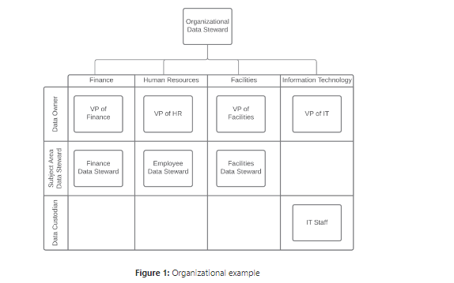
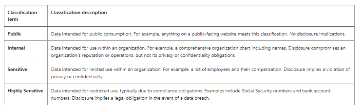
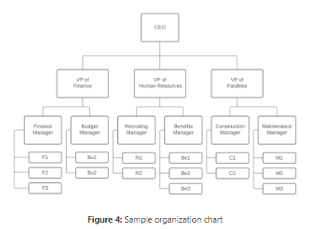
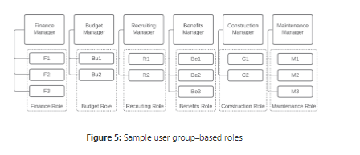

# Data Governance Concepts

* Data governance requires a team of individuals fulfilling various roles.
* Data stewardship involves managing data quality, security, privacy, and compliance.
* The organizational data steward leads data governance activities.
* Data stewards act as a bridge between technical and non-technical divisions.
* Data owners are senior business leaders responsible for specific data domains.
* Subject area data stewards handle daily governance tasks delegated by data owners.
* Data custodians implement technical controls to execute data governance policies.
* Effective data governance relies on collaboration among data stewards, owners, subject area stewards, and custodians..  

## Access Permissions

*  Role-based access means that instead of giving access to individual people, you grant access to the role they occuppy.

## Group Permissions

* It's best to start by visualizing people within an organization when creating data access roles. An organization chart documents the reporting structure within an organization. 

## Data Use Agreements

A data use agreement (DUA) is a contractual document for transferring private data between organizations. You should establish a DUA before sharing data with an outside party. It is essential to understand the classification for each piece of data when crafting a DUA. The more sensitive a data element is, the more critical it is to prepare appropriate sharing-related language.

* Identifying who will receive the data
* Identifying how the data can be used
* Prohibiting the further distribution of the data
* Establishing the method of transfer
* Identifying how the recipient will protect the data

## Security Requirements

* encryption is the process of encoding data with a key so that only authorized parties can read it. 
* encryption key is a series of letters, numbers, and symbols used during the encoding process to make data unreadable.
* Transparent Data Encryption (TDE) as part of their database offering.

