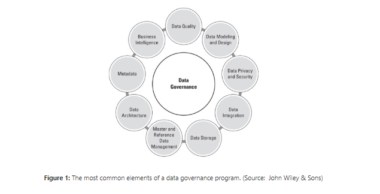
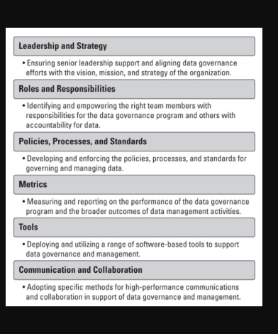
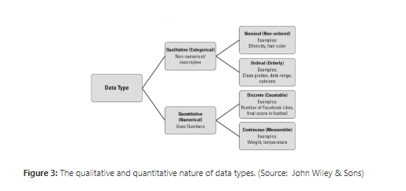
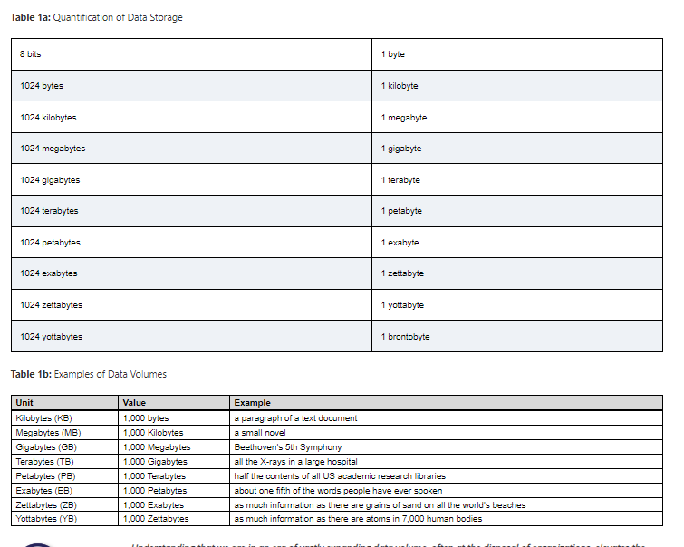
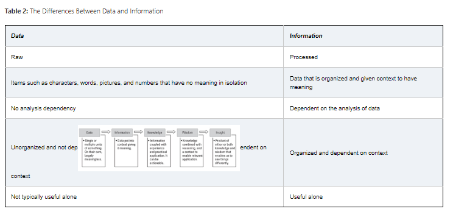
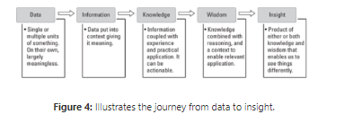
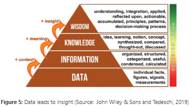

# Chapter One

##  Define Data Governance:
Data governance refers to the overall management of the availability, usability, integrity, and security of data used in an enterprise or organization. It involves establishing processes, policies, standards, and metrics to ensure that data assets are managed effectively and responsibly.

- is simple about proactively managing the quality of your data

## What is meant by governance

Data governance serves as a structured approach to overseeing the quality and utilization of data assets, enabling organizations to align with their strategic objectives and aspirations. Essentially, it revolves around the adept management of data resources. A finely-tuned data management strategy not only cultivates exponential growth but also positions data as a pivotal catalyst for achieving remarkable success within a company.

## The value of Data Governance

### Advantages ahcived by data governance includes: 

Improved data quality
Expanded data value
Increased data compliance
Improved data-driven decision-making
Enhanced business performance
Greater sharing and use of data across the enterprise and externally
Increased data availability and accessibility
Improved data search
Reduced risks from data-related issues
Reduced data management costs
Established rules for handling data

### The basic steps for creating a data governance program consist of the following. These steps also form the basic outline of this course.

Defining the vision, goals, and benefits.
Analyzing the current state of data governance and management.
Developing a proposal based on the first two steps, including a draft plan.
Achieving leadership approval.
Designing and developing the program.
Implementing the program.
Monitoring and measuring performance.
Maintaining the program.

### Developing a Data Governance Framework

Data Governance Versus Data Management

* . Data governance is focused on roles and responsibilities, policies, definitions, metrics, and the lifecycle of data. 

* Data management is the technical implementation of data governance.

Data Governance versus Information Governance

* . Data governance generally focuses on data, independent of its meaning. For example, you may want to govern the security of patient data and staff data from a policy and process perspective, despite their differences.

* Information Governance - business context

What is data culture?

* is the collective behaviors and beliefs of people who value, practice, and encourage the use of data to improve decision-making

## Maturing the Data Culture

Help leaders communicate the value of data and model the type of behavior that demonstrates that data is a priority. This must include communicating the positive results of using data.
Provide basic tools and education for data use that include manipulating data, analytics, data cleansing, basic query commands, and visualization. Don’t overlook the remarkable capabilities of common applications such as spreadsheets.
Do something, even if it’s small, to show progress. A successful data culture doesn’t begin with the deployment of complex, far-reaching solutions. Rather, it can be eased into the organization via basic data-management skills offered in a classroom setting or online.
Recognize that resistance and frustration are part of the journey. Rather than fighting it, find ways to bring comfort and rewards to team members. At a minimum, provide a channel for feedback and positive discussion.

## The following basic checklist of items will help you determine the data governance readiness of your organization:

The basis of a data culture exists.
The program is 100 percent aligned with business strategy.
Senior leadership is 100 percent committed to the program and its goals.
Senior leadership understands this is a strategic, enterprise program and not the sole responsibility of the IT department.
One or more sponsors have been identified at an executive level.
The program has the commitment to fund its creation and to maintain it in the long term.
The organization understands this is an ongoing program and not a one-off project.
You have documented the return-on-investment (ROI).
Legal and compliance teams (internally or externally) understand and support the goals of the program.
Fundamental data skills exist for the data governance journey.
The IT organization is capable and resourced to support the program.

# Chapter Two

* Defining Data

Data refers to collections of digitally stored units, in other words, stuff that is kept on a computing device. These units represent something meaningful when processed for a human or a computer. Single units of data are traditionally referred to as datum and multiple units as data. 

Data is also defined based on its captured format. Specifically, at a high level, it falls into one of the following categories:

Structured: Data that has been formatted to a set structure; each data unit fits nicely into a table in a database. It’s ready for analysis. Examples include first name, last name, and phone number.
Unstructured: Data that are stored in a native format must be processed to be used. Further work is required to enable analysis. Examples include email content and social media posts.
Semi-structured: Data that contains additional information to enable the native format to be searched and analyzed.

The Zettabyte Era

## Data-Driven Decision-Making
* Perhaps one of the greatest values of data is its ability to help us all make better decisions.

## Data as The New Oil
* A popular refrain coined by the mathematician Clive Humby in 2006 is that data is the new oil. Just as oil drove and grew economies in the past, data is doing that now. 

## Data Ownership

Data ownership describes the rights a person, team, or organization has over one or more data sets. These rights may span from lightweight oversight and control to rigorous rules that are legally enforceable. For example, data associated with intellectual property — items such as copyrights and trade secrets — will likely have high degrees of protection, from accessibility rights to who can use the data and for what purpose.

## Data Architecture

* When designing the technical needs of an organization to support its business strategy, this practice is known as enterprise architecture (EA).

* A subset of EA is data architecture

* Data architecture is the agreed blueprint for how data supports an organization’s functions and technologies.

At a minimum, data architecture considers and typically supports the following:

Ensuring data is available to those who need it and are approved to use it.
Reducing the complexity of accessing and utilizing data
Creating and enforcing data protections to support organizational policies and obligations.
Adopting and agreeing to data standards
Optimizing the flow and efficient use of data to eliminate bottlenecks and duplication

* Data architecture is a direct reflection of data governance. An established and functioning data architecture immediately signals that an organization values data, manages it as a critical business asset, and has controls in place to ensure that it aligns with business needs.

* Creation:  This is the stage at which data comes into being. It may be manual or automated and get created internally or externally. Data is created all the time by a vast number of activities that include system inputs and outputs.

* Storage:  Once data is created and assuming you want it available for later use, it must be stored. It most likely will be contained and managed in a database. The database needs a home, too as a local hard drive, server, or cloud service.
  
* Usage:  Hopefully you’re capturing and storing data because you want to use it. Maybe not immediately, but at some point, perhaps for analysis. Data may need to be processed to be useful. That could include cleansing it of errors, transforming it to another format, and securing access rights.

* Archival:  In this stage, you identify data that is not currently being used and move it to a long-term storage system out of your production environment. If it's needed at some point in the future, it can be retrieved and utilized.

* Destruction:  Despite a desire by some to keep everything forever, there is a logical point where destruction makes sense or is required by regulation or policy. Data destruction involves making data inaccessible and unreadable. It can include the physical destruction of a device such as a hard drive.

